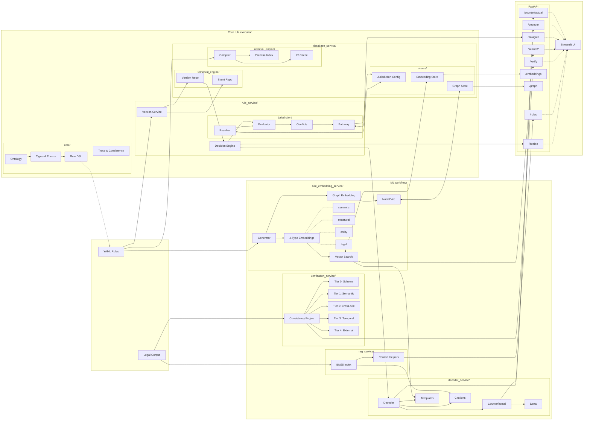

# Regulatory Knowledge Engineering Workbench

A computational law platform for MiCA, RWA tokenization, and stablecoin frameworks. Transforms regulatory documents into executable rules with traceable decision logic.

**Live Demo:** [pazooki.streamlit.app](https://pazooki.streamlit.app)

## Architecture



## Project Structure

```
backend/
├── core/                    # Shared infrastructure
│   ├── config.py            # Settings & feature flags
│   ├── database.py          # SQLModel ORM utilities
│   ├── ontology/            # Domain types (Actor, Instrument, Provision)
│   ├── visualization/       # Tree rendering (Graphviz, Mermaid)
│   └── api/                 # FastAPI routers
│
├── rule_service/            # Rule management & evaluation
│   ├── data/                # YAML rule packs (MiCA, FCA, GENIUS)
│   └── app/services/
│       ├── loader.py        # YAML parsing
│       ├── engine.py        # Decision engine
│       └── jurisdiction/    # Multi-jurisdiction (resolver, evaluator, conflicts)
│
├── database_service/        # Persistence & compilation
│   └── app/services/
│       ├── compiler/        # YAML → IR compilation
│       └── runtime/         # IR cache & execution
│
├── verification_service/    # Semantic consistency
│   └── app/services/        # Tier 0-4 consistency checks
│
├── analytics_service/       # Error patterns & drift
│   └── app/services/        # Pattern analysis, drift detection
│
├── rag_service/             # Retrieval-augmented context
│   └── app/services/        # BM25 index, context helpers
│
└── rule_embedding_service/  # Vector embeddings & similarity search
    └── app/services/
        ├── models.py        # RuleEmbedding, EmbeddingType
        ├── generator.py     # 4-type embedding generation
        └── service.py       # CRUD + vector search

frontend/
├── Home.py                  # Landing page
└── pages/
    ├── 1_KE_Workbench.py    # Rule verification & review
    ├── 2_Production_Demo.py # IR compilation & benchmarks
    └── 3_Navigator.py       # Cross-border compliance

data/legal/                  # Legal corpus (MiCA, FCA, GENIUS Act)
docs/                        # Design documentation
```

## Regulatory Frameworks

| Framework | Jurisdiction | Status |
|-----------|--------------|--------|
| MiCA | EU | Modeled (9 rules) |
| FCA Crypto | UK | Modeled (5 rules) |
| GENIUS Act | US | Illustrative (6 rules) |
| RWA Tokenization | EU | Illustrative (2 rules) |

## Rule Embeddings

The system generates 4 types of vector embeddings per rule for multi-faceted similarity search:

| Type | Source | Use Case |
|------|--------|----------|
| **Semantic** | Name, description, decision explanation | Natural language search |
| **Structural** | Conditions, operators, decision logic | Find structurally similar rules |
| **Entity** | Field names, operators | Find rules using same data fields |
| **Legal** | Citations, document IDs | Find rules from same legal sources |

- Uses `sentence-transformers` (all-MiniLM-L6-v2) for dense embeddings
- Falls back to hash-based vectors when ML unavailable
- SQLite: JSON arrays; PostgreSQL: pgvector ready

## Documentation

- [Knowledge Model](docs/knowledge_model.md) — Ontology design
- [Rule DSL](docs/rule_dsl.md) — YAML rule specification
- [Engine Design](docs/engine_design.md) — Architecture details
- [Embedding Service](docs/embedding_service.md) — Vector search design

## Disclaimer

Research/demo project, not legal advice. Rules are interpretive models—consult qualified legal counsel for compliance decisions.

## License

MIT License. See [LICENSE](LICENSE).

---

Built with [Claude Code](https://claude.ai/code)
