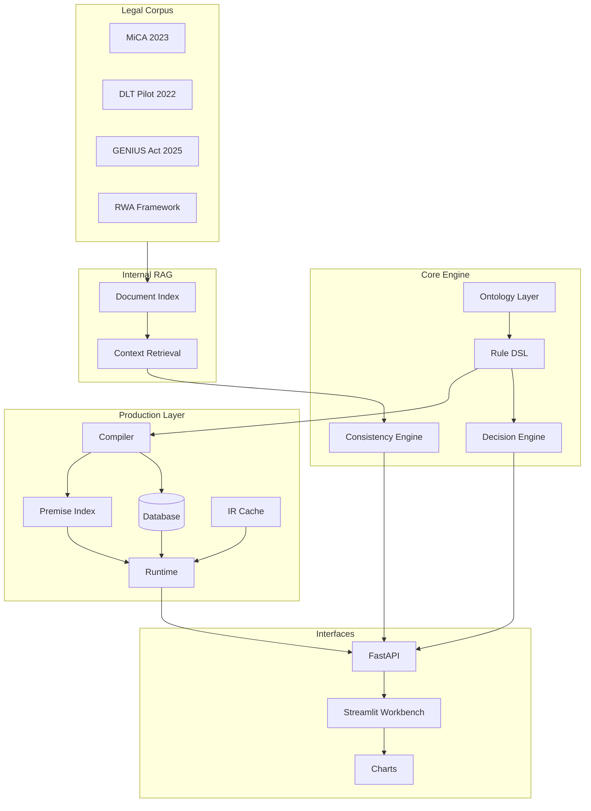

# Regulatory Knowledge Engineering Workbench

**A Computational Law Platform for MiCA, RWA Tokenization, and Stablecoin Frameworks**

Transforms regulatory documents into executable knowledge through ontology extraction, declarative rules, and traceable decision logic.

---

## Why This Exists

Financial regulation is complex, multi-jurisdictional, and constantly evolving. Traditional compliance relies on legal memos and manual interpretation—approaches that don't scale and can't be audited systematically.

This system takes a different approach: encode regulations as *executable rules* with full traceability back to source legal text. Each decision produces a machine-readable trace showing exactly which provisions applied and why. This enables:

- **Automated compliance checking** against real regulatory frameworks (MiCA, DLT Pilot, GENIUS Act)
- **Knowledge engineering workflows** for legal teams to model, verify, and maintain rules
- **Semantic consistency verification** ensuring rules faithfully represent source provisions
- **Gap analysis** identifying legal provisions without corresponding rule coverage

The system currently models the EU's Markets in Crypto-Assets Regulation (MiCA), the DLT Pilot Regime, an illustrative RWA tokenization framework, and the proposed US GENIUS Act for stablecoin oversight.

---

## Architecture



### Component Summary

| Component | Purpose | Key Modules |
|-----------|---------|-------------|
| **Legal Corpus** | Normalized excerpts of source regulations | `data/legal/mica_2023/`, `genius_act_2025/`, etc. |
| **Ontology** | Typed domain model (Actor, Instrument, Activity, Provision) | `backend/ontology/`, `ocaml/core/ontology.ml` |
| **Rule DSL** | YAML-based declarative rules with decision trees | `backend/rules/`, `ocaml/core/rule_dsl.ml` |
| **Decision Engine** | Evaluates scenarios, produces traces and obligations | `backend/rules/engine.py` |
| **Consistency Engine** | Tier 0-4 verification of rules against source text | `backend/verify/consistency_engine.py` |
| **Persistence** | SQLite database for rules, verifications, reviews | `backend/persistence/` |
| **Compiler** | Compiles rules to IR for efficient execution | `backend/compiler/` |
| **Runtime** | Linear IR evaluation with O(1) rule lookup | `backend/runtime/` |
| **Internal RAG** | Context retrieval for KE workflows (not public Q&A) | `backend/rag/rule_context.py` |
| **KE Workbench** | Streamlit UI for rule inspection and review | `frontend/ke_dashboard.py` |
| **Charts** | Interactive tree visualizations | `backend/visualization/`, `frontend/pages/charts.py` |

---

## Key Features

- **Multi-rulebook support** — MiCA (EU crypto-assets), RWA tokenization, DLT Pilot Regime, GENIUS Act (US stablecoins)
- **Executable rules with decision traces** — Every evaluation produces a step-by-step trace linking back to source provisions
- **Tiered semantic consistency checks** — Tier 0 (schema), Tier 1 (lexical), Tier 2-4 (semantic/NLI, stub)
- **Production-grade architecture** — Compiled IR, O(1) rule lookup via premise index, linear evaluation
- **Database persistence** — SQLite (PostgreSQL-compatible) for rules, verification results, and human reviews
- **Internal RAG for legal context** — Source text retrieval, related provisions, coverage gap detection
- **KE workbench** — Decision tree viewer, evidence panel, review queue, analytics dashboard
- **Interactive charts** — Rulebook outline, ontology browser, corpus-rule links, legal corpus coverage
- **Pure Python deployment** — Runs on Streamlit Cloud without OCaml compilation

---

## KE Workbench User Guide

The Knowledge Engineering (KE) Workbench is a Streamlit application for inspecting, verifying, and reviewing regulatory rules.

### Workbench Layout

```
┌─────────────────────────────────────────────────────────────────────────────┐
│  ⚖️ KE Workbench                           [🔍 Verify All] [↺ Reset]        │
│  Workflow: Queue → Review → Test → Submit                                   │
│  📊 7 rules | ✓ 0 verified | ⚠ 7 needs review | ✗ 0 inconsistent           │
├──────────────┬────────────────────────────────────┬─────────────────────────┤
│              │                                    │                         │
│  📋 RULES    │     RULE DETAILS                   │  📖 CONTEXT             │
│              │                                    │                         │
│  ○ Queue     │  mica_art36_public_offer_auth      │  mica_2023 Art. 36      │
│  ● Navigator │  ┌─────────┬─────────┬──────────┐  │                         │
│              │  │Decision │Trace/   │Analytics │  │  ▼ Primary text         │
│  ▼ Mica 2023 │  │Tree     │Test     │          │  │  "Any person intending  │
│    ? rule_1  │  └─────────┴─────────┴──────────┘  │   to offer crypto-      │
│    ? rule_2  │                                    │   assets..."            │
│  ▼ Rwa 2025  │  [Tree visualization or           │                         │
│    ? rule_3  │   test interface or               │  ▼ Related provisions   │
│              │   analytics charts]               │  • Art. 37 (0.82)       │
│  ─────────── │                                    │  • Art. 48 (0.71)       │
│  📊 Insights │                                    │                         │
│  Total: 7    │                                    │                         │
│  Verified: 0 │                                    │                         │
│              │                                    │                         │
└──────────────┴────────────────────────────────────┴─────────────────────────┘
```

### Workflow Steps

**Step 1: Select a Rule**
- Use **Queue** view to see rules prioritized by verification status
- Use **Navigator** view to browse by document hierarchy
- Status indicators: `?` needs review, `✓` verified, `✗` inconsistent

**Step 2: Review Decision Tree**
- Visual tree shows rule's decision logic
- Toggle **Overlay** to see consistency status on each node
- Green = pass, Yellow = warning, Red = fail

**Step 3: Run Trace Test**
- Enter test scenario values in the **Trace/Test** tab
- Click **Run Trace** to execute rule against scenario
- View step-by-step evaluation path
- Check if decision matches expected behavior

**Step 4: Review Analytics**
- **Analytics** tab shows verification evidence
- Pie chart: Pass/Warn/Fail distribution
- Evidence table: Tier, Category, Label, Score, Details
- Confidence score: Weighted average of all checks

**Step 5: Submit Review**
- If rule behaves correctly, mark as verified
- If issues found, mark as inconsistent with notes

### Left Panel: Rules Selection

| Mode | Description | Use When |
|------|-------------|----------|
| **Queue** | Rules sorted by urgency | Processing review backlog |
| **Navigator** | Hierarchical by document | Exploring specific regulation |

**Queue Filters:**
- Status: `needs_review`, `unverified`, `inconsistent`, `all`
- Document: Filter by source document (MiCA, RWA, etc.)

**Navigator Structure:**
```
▼ Mica 2023 (4)
  ? mica_art36_public_offer_authorization (Art.36(1))
  ? mica_art38_reserve_assets (Art.38)
  ? mica_art48_emt_authorization (Art.48)
  ✓ mica_art45_significant_art (Art.45)
▼ Rwa Eu 2025 (3)
  ...
```

### Center Panel: Rule Details

#### Decision Tree Tab

```
                    ┌─────────────────────┐
                    │   check_exemption   │
                    │ is_credit_inst==T   │
                    └──────────┬──────────┘
                         ┌─────┴─────┐
                      TRUE         FALSE
                         │           │
                    ┌────┴────┐ ┌────┴────┐
                    │ exempt  │ │  check  │
                    │         │ │  auth   │
                    └─────────┘ └────┬────┘
                                ┌────┴────┐
                             TRUE      FALSE
                                │         │
                           ┌────┴────┐ ┌──┴──┐
                           │permitted│ │deny │
                           └─────────┘ └─────┘
```

- **[Verify]** - Run consistency checks on this rule
- **[Overlay ☑]** - Color nodes by consistency status

#### Trace/Test Tab

| Field | Input | Description |
|-------|-------|-------------|
| `instrument_type` | Dropdown | `art`, `emt`, `stablecoin`, etc. |
| `activity` | Dropdown | `public_offer`, `admission_trading`, etc. |
| `jurisdiction` | Text | `EU`, `US`, etc. |
| `is_credit_institution` | Checkbox | Whether actor is licensed bank |
| `authorized` | Checkbox | Whether already authorized |

**Expected Outputs:**
- **Decision**: `authorized`, `not_authorized`, `exempt`, etc.
- **Trace Table**: Node → Condition → Result (✓/✗) → Value

#### Analytics Tab

```
┌─────────────────────────────────────────────┐
│  Pass: 6    Fail: 0    Warn: 6    Conf: 78% │
├─────────────────────────────────────────────┤
│         ┌──────────┐                        │
│         │   50%    │ 50%   ■ Pass           │
│         │  Green   │Yellow │ ■ Warning      │
│         └──────────┘       │ ■ Fail         │
├─────────────────────────────────────────────┤
│  Evidence Details                           │
│  Tier │ Category         │ Label │ Score   │
│  ─────┼──────────────────┼───────┼──────── │
│  0    │ schema_valid     │ pass  │ 100%    │
│  0    │ required_fields  │ pass  │ 100%    │
│  1    │ deontic_align    │ warn  │ 60%     │
│  1    │ keyword_overlap  │ pass  │ 85%     │
└─────────────────────────────────────────────┘
```

### Right Panel: Context

- **Primary text**: Source legal provision text
- **Document metadata**: Citation, jurisdiction, article reference
- **Related provisions**: Similar rules ranked by similarity score

### Header Actions

| Button | Action | Effect |
|--------|--------|--------|
| **Verify All** | Run Tier 0-1 checks on all rules | Updates all verification statuses |
| **Reset** | Clear all session state | Returns to initial view |

### Quick Stats

The **Insights** section shows:
- **Total Rules**: Count of all loaded rules
- **Needs Review**: Rules with warnings or unverified
- **Verified**: Rules marked as consistent
- **Inconsistent**: Rules with failed checks
- **Progress bar**: Percentage verified

### Charts Page

Access via sidebar navigation to see:
- **Rulebook Outline**: Hierarchical view of legal corpus with coverage
- **Ontology Browser**: Actor/Instrument/Activity type hierarchy
- **Corpus Links**: Document → Article → Rule traceability

### Production Architecture Demo

Access via sidebar navigation (`Production Demo`) to explore:

| Section | What It Shows |
|---------|---------------|
| **Architecture Overview** | Side-by-side comparison of traditional O(n) vs production O(1) lookup |
| **Compile Rules** | Transform YAML rules to compiled IR with premise keys |
| **Premise Index** | Inverted index statistics and contents (field:value → rule_ids) |
| **IR Cache** | Cache hit/miss rates and memory statistics |
| **Performance Comparison** | Real-time benchmarking of single scenario evaluation |
| **Batch Evaluation** | Compare throughput for 10-100 scenarios |

**Demo Workflow:**
1. Click **Compile All Rules** to build IR and premise index
2. Configure a test scenario (instrument type, jurisdiction, activity)
3. Click **Run Performance Comparison** to see speedup metrics
4. Try **Batch Evaluation** to see throughput at scale

---

## Getting Started

### Prerequisites

- Python 3.11+
- Git

### Installation

```bash
# Clone the repository
git clone https://github.com/hossainpazooki/RWAs.git
cd RWAs

# Create virtual environment
python -m venv .venv

# Activate (Windows PowerShell)
.\.venv\Scripts\Activate

# Activate (macOS/Linux)
source .venv/bin/activate

# Install dependencies
pip install -r requirements.txt
```

### Run Tests

```bash
pytest tests/ -v
```

### Launch KE Workbench

```bash
streamlit run frontend/ke_dashboard.py
```

The workbench opens at `http://localhost:8501` with:
- Rule selection and decision tree visualization
- Consistency evidence panel
- Source context and related provisions
- Charts page for rulebook/coverage analysis

### Run API Server (Optional)

```bash
uvicorn backend.main:app --reload
```

API available at `http://localhost:8000` with endpoints:
- `POST /decide` — Evaluate scenario against rules
- `GET /rules` — List loaded rules
- `GET /ke/*` — Internal KE endpoints
- `POST /v2/migrate` — Migrate YAML rules to database
- `POST /v2/rules/compile` — Compile all rules to IR
- `POST /v2/rules/{id}/evaluate` — Evaluate with compiled IR
- `POST /v2/evaluate` — Batch evaluation with O(1) lookup

### Optional Dependencies

```bash
# ML features (vector search, semantic similarity)
pip install -r requirements-ml.txt

# Visualization enhancements
pip install -r requirements-visualization.txt
```

---

## Repository Structure

```
RWAs/
├── backend/
│   ├── ontology/          # Domain types (Actor, Instrument, Provision, etc.)
│   ├── rules/             # YAML rule files + decision engine
│   │   ├── mica_authorization.yaml   # MiCA public offer rules (3 rules)
│   │   ├── mica_stablecoin.yaml      # MiCA stablecoin/ART/EMT (6 rules)
│   │   ├── genius_stablecoin.yaml    # GENIUS Act US stablecoins (6 rules)
│   │   └── rwa_authorization.yaml    # RWA tokenization (2 rules)
│   ├── verify/            # Semantic consistency engine
│   ├── analytics/         # Error patterns, drift detection
│   ├── rag/               # Internal retrieval (BM25, context)
│   ├── visualization/     # Tree adapters, chart rendering
│   └── api/               # FastAPI routes
├── frontend/
│   ├── ke_dashboard.py    # Main Streamlit app
│   └── pages/             # Charts, Review Queue
├── ocaml/
│   └── core/              # OCaml ontology + rule DSL (source of truth)
├── data/
│   └── legal/             # Legal corpus (MiCA, DLT Pilot, GENIUS)
├── docs/                  # Design documentation
├── tests/                 # Test suite (375+ tests)
└── requirements.txt
```

---

## Conceptual Layers

### Layer 1-2: Ontology & Rule DSL (OCaml + Python)

The formal type system for regulatory knowledge:

- **Ontology types**: `Actor`, `Instrument`, `Activity`, `Provision`, `Obligation`
- **Relation types**: `IMPOSES_OBLIGATION_ON`, `PERMITS`, `PROHIBITS`, `EXEMPTS`
- **Rule DSL**: YAML schema with `applies_if` conditions and `decision_tree` logic
- OCaml source in `ocaml/core/`, Python mirrors in `backend/ontology/`

### Layer 3A: Decision Engine

Deterministic rule evaluation with full traceability:

- **RuleLoader**: Parses YAML rules into executable structures
- **DecisionEngine**: Evaluates scenarios against applicable rules
- **TraceStep**: Records each condition evaluation for explainability
- See `backend/rules/engine.py`

### Layer 3B: Semantic Consistency Engine

Automated verification of rules against source legal text:

| Tier | Status | Description |
|------|--------|-------------|
| 0 | Implemented | Schema validation, required fields, date consistency |
| 1 | Implemented | Deontic alignment, keyword overlap, negation checks |
| 2 | Stub | Semantic similarity (requires sentence-transformers) |
| 3 | Stub | NLI entailment checking |
| 4 | Stub | Cross-rule consistency |

See `backend/verify/consistency_engine.py` and [Semantic Consistency Spec](docs/semantic_consistency_regulatory_kg.md).

### Layer 4: Internal RAG

Context retrieval for KE workflows (not public-facing):

- **Document indexing**: BM25 with optional vector embeddings
- **Source retrieval**: Get legal text backing a rule
- **Related provisions**: Find similar rules with structural filtering
- **Coverage gaps**: Identify legal text without mapped rules
- See `backend/rag/rule_context.py`

### Layer 5: KE Interfaces

Tools for knowledge engineers:

- **Streamlit workbench**: Decision tree viewer, evidence panel, review queue
- **Charts**: Rulebook outline, ontology browser, corpus coverage
- **FastAPI /ke endpoints**: Programmatic access to verification and analytics
- See `frontend/ke_dashboard.py`, `backend/api/routes_ke.py`

---

## Rulebooks Modeled

| Document ID | Framework | Jurisdiction | Status | Example Rules |
|-------------|-----------|--------------|--------|---------------|
| `mica_2023` | Markets in Crypto-Assets (MiCA) | EU | Modeled | `mica_art36_public_offer_authorization`, `mica_art38_reserve_assets` |
| `rwa_eu_2025` | RWA Tokenization | EU | Illustrative | `rwa_tokenization_authorization`, `rwa_custody_requirements` |
| `dlt_pilot_2022` | DLT Pilot Regime | EU | Corpus only | Future rule modeling planned |
| `genius_act_2025` | GENIUS Act (Stablecoins) | US | Illustrative | Based on proposed bill; some provisions fictionalized |

**Note**: MiCA rules are based on the published regulation. RWA and GENIUS rules are illustrative models for demonstration purposes.

---

## How to Extend

### Add a New Rulebook

1. Create legal corpus entry in `data/legal/{document_id}/`:
   - `meta.yaml` with document metadata
   - `text_normalized.txt` with normalized excerpts

2. Create rule file in `backend/rules/{document_id}.yaml`

3. Map rules to corpus via `source.document_id`

### Add Rules to Existing Rulebook

1. Edit the appropriate YAML file in `backend/rules/`
2. Follow the [Rule DSL specification](docs/rule_dsl.md)
3. Run `pytest tests/test_rules.py -v` to validate

### Modify Semantic Checks

1. Edit `backend/verify/consistency_engine.py`
2. Add new check methods following existing patterns
3. Update tests in `tests/test_consistency_engine.py`

### Documentation

- Update `docs/*.md` when changing ontology, DSL, or engine behavior
- Keep `CLAUDE.md` current for AI assistant context

---

## Status & Disclaimers

**This is a research/demo project, not legal advice.**

- Rules are interpretive models of regulatory text, not authoritative legal guidance
- The GENIUS Act rulebook is based on a proposed bill and includes fictionalized provisions
- Coverage is illustrative—not all provisions from source documents are modeled
- Always consult qualified legal counsel for compliance decisions

---

## Documentation

- [Knowledge Model](docs/knowledge_model.md) — Ontology design, type definitions, worked examples
- [Rule DSL](docs/rule_dsl.md) — YAML rule specification, operators, decision trees
- [Engine Design](docs/engine_design.md) — KE workbench architecture, layer descriptions
- [Semantic Consistency](docs/semantic_consistency_regulatory_kg.md) — Verification tiers, evidence structures

---

## License

MIT License. See [LICENSE](LICENSE) for details.

---

## Credits

Built with assistance from [Claude Code](https://claude.ai/code) (Anthropic).

Regulatory frameworks referenced:
- [MiCA - Regulation (EU) 2023/1114](https://eur-lex.europa.eu/eli/reg/2023/1114/oj)
- [DLT Pilot - Regulation (EU) 2022/858](https://eur-lex.europa.eu/eli/reg/2022/858/oj)
- [GENIUS Act - S.394 (118th Congress)](https://www.congress.gov/bill/118th-congress/senate-bill/394)
